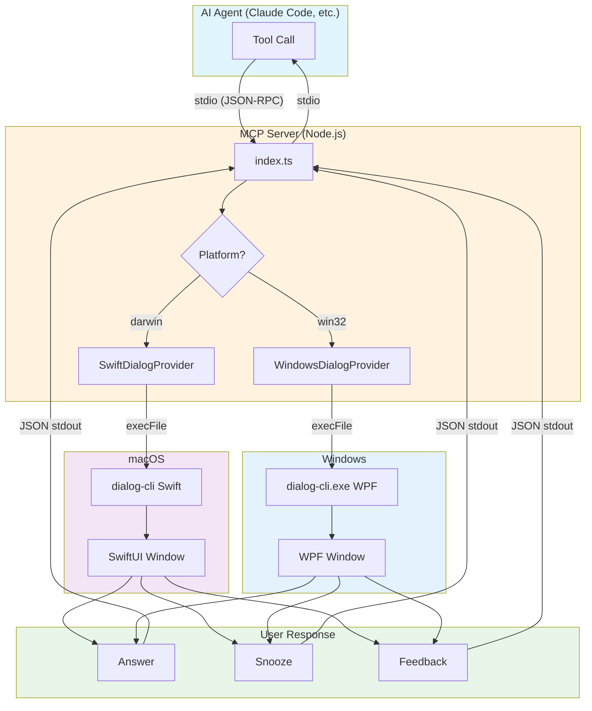

# Consult User MCP

Native dialog system for MCP (Model Context Protocol) servers. **macOS and Windows.**

Keep working while your AI agent runs autonomously. When it needs your input, a native dialog appears - answer the question, and the agent continues. No need to watch the terminal. Snooze if you're busy, or send feedback to redirect the agent.

[See screenshots and full documentation →](https://doublej.github.io/consult-user-mcp/)

## Quick Install

**macOS:**
```bash
curl -sSL https://raw.githubusercontent.com/doublej/consult-user-mcp/main/install.sh | bash
```

**Windows:**
Download the installer from [Releases](../../releases) and run it. First-run wizard automatically configures Claude Code.

## Contents

- [Install](#install)
  - [macOS](#macos)
  - [Windows](#windows)
  - [MCP Server Only](#mcp-server-only)
- [Uninstall](#uninstall)
  - [macOS uninstaller](#macos-uninstaller)
  - [Windows uninstaller](#windows-uninstaller)
- [Build from Source](#build-from-source)
- [Structure](#structure)
- [MCP Tools](#mcp-tools)
- [Architecture](#architecture)

## Install

### macOS

**Quick install:**
```bash
curl -sSL https://raw.githubusercontent.com/doublej/consult-user-mcp/main/install.sh | bash
```

**Manual install:**
1. Download **Consult User MCP.app.zip** from [Releases](../../releases) (look for `macos/vX.Y.Z`)
2. Unzip and drag to `/Applications`
3. Remove the quarantine flag (required for non-notarized apps):
   ```bash
   xattr -cr "/Applications/Consult User MCP.app"
   ```
4. Launch the app - a menu bar icon appears
5. Click the menu bar icon and use **Install for Claude Code** to automatically configure the MCP server

### Windows

1. Download the installer from [Releases](../../releases) (look for `windows/vX.Y.Z`)
2. Run the installer - it configures everything automatically
3. The system tray app launches at startup

The first-run wizard automatically configures Claude Code. Settings, snooze state, and history are stored in `%APPDATA%\ConsultUserMCP\`.

### MCP Server Only

If you don't want the tray app, you can run the MCP server standalone:

```bash
git clone https://github.com/doublej/consult-user-mcp.git
cd consult-user-mcp/mcp-server
bun install && bun run build
```

Add to your MCP config:

```json
{
  "mcpServers": {
    "consult-user-mcp": {
      "command": "node",
      "args": ["/path/to/consult-user-mcp/mcp-server/dist/index.js"]
    }
  }
}
```

## Uninstall

### macOS uninstaller

```bash
curl -sSL https://raw.githubusercontent.com/doublej/consult-user-mcp/main/uninstall.sh | bash
```

Optional flags:
- `--keep-data` keeps `~/Library/Application Support/ConsultUserMCP` and `~/.config/consult-user-mcp/projects.json`
- `--dry-run` prints planned changes without modifying files

### Windows uninstaller

You can uninstall from **Installed apps** in Windows settings.

For full cleanup (MCP entries + base prompt block + app files), run:

```powershell
powershell -ExecutionPolicy Bypass -File .\uninstall.ps1
```

Optional flags:
- `-KeepData` keeps `%APPDATA%\ConsultUserMCP` and `%USERPROFILE%\.config\consult-user-mcp\projects.json`
- `-DryRun` prints planned changes without modifying files

## Build from Source

**macOS:**
```bash
bun install
bun run build:bundle   # Builds and installs to /Applications
```

**Windows:** See [CLAUDE.md](CLAUDE.md) for Windows build instructions (requires .NET SDK 8.0 and Velopack).

## Structure

```
consult-user-mcp/
├── mcp-server/          # MCP server (TypeScript, cross-platform)
├── dialog-cli/          # macOS: Swift CLI for dialogs
├── macos-app/           # macOS: SwiftUI menu bar app
├── dialog-cli-windows/  # Windows: WPF CLI for dialogs
├── windows-app/         # Windows: WPF system tray app
├── docs/                # Documentation site (SvelteKit)
└── scripts/             # Build and release scripts
```

## MCP Tools

| Tool | Purpose |
|------|---------|
| `ask` | Interactive dialog (`type`: `confirm`, `pick`, `text`, or `form`) |
| `notify` | Fire-and-forget notification |
| `tweak` | Real-time numeric value adjustment with live file writes |

### Timeout and Snooze

All interactive dialogs (`ask`, `tweak`) have a **10-minute timeout**.

**Snooze:** Users can snooze a dialog for 1-60 minutes. When snoozed:
- Returns `{ snoozed: true, remainingSeconds: S }`
- All subsequent calls return the same until snooze expires
- Agent should `sleep` for `remainingSeconds`, then retry

**Feedback:** Users can send text feedback instead of answering. Returns `{ feedbackText: "..." }` for the agent to adjust its approach.

## Architecture



### Flow

1. **Agent calls tool** - Claude Code (or any MCP client) invokes `ask`, `notify`, or `tweak`
2. **MCP Server receives** - TypeScript server validates input with Zod schemas
3. **Platform dispatch** - Server spawns the native CLI for the current platform
4. **Dialog shown** - Native window appears (SwiftUI on macOS, WPF on Windows)
5. **User responds** - Answer, snooze, or feedback
6. **Result returned** - JSON flows back through CLI → MCP Server → Agent
