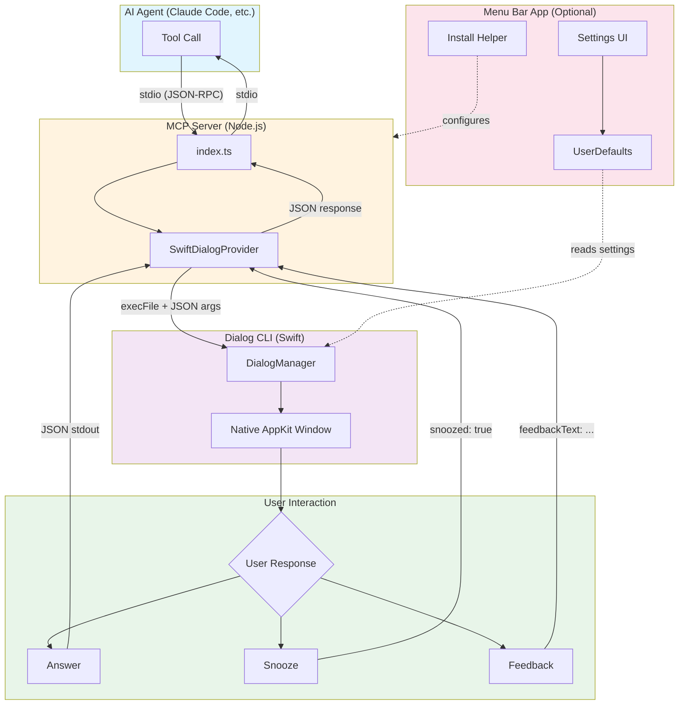

# Consult User MCP

Native macOS dialog system for MCP (Model Context Protocol) servers.

Keep working while your AI agent runs autonomously. When it needs your input, a native dialog appears - answer the question, and the agent continues. No need to watch the terminal. Snooze if you're busy, or send feedback to redirect the agent.

<table>
<tr>
<td align="center"><br><sub>Confirmation dialog</sub></td>
<td align="center"><br><sub>Snooze for later</sub></td>
<td align="center"><br><sub>Send feedback to agent</sub></td>
</tr>
<tr>
<td align="center"><br><sub>Multi-select options</sub></td>
<td align="center"><br><sub>Wizard - step 1</sub></td>
<td align="center"><br><sub>Wizard - step 2</sub></td>
</tr>
<tr>
<td align="center" colspan="3"><br><sub>Accordion - multiple questions at once</sub></td>
</tr>
</table>

## Quick Install

```bash
curl -sSL https://raw.githubusercontent.com/doublej/consult-user-mcp/main/install.sh | bash
```

## Contents

- [Install](#install)
  - [MCP Server Only](#option-1-mcp-server-only)
  - [With macOS App](#option-2-with-macos-app-optional)
- [Build from Source](#build-from-source)
- [Structure](#structure)
- [MCP Tools](#mcp-tools)
- [Architecture](#architecture)

## Install

### Option 1: MCP Server Only

```bash
git clone https://github.com/doublej/consult-user-mcp.git
cd consult-user-mcp/mcp-server
bun install && bun run build
```

Add to your MCP config:

```json
{
  "mcpServers": {
    "consult-user-mcp": {
      "command": "node",
      "args": ["/path/to/consult-user-mcp/mcp-server/dist/index.js"]
    }
  }
}
```

### Option 2: With macOS App (Optional)

The menu bar app provides a settings UI for dialog position, sounds, and speech rate. It also includes a built-in installer that can configure Claude Code for you automatically.

**Quick install:**
```bash
curl -sSL https://raw.githubusercontent.com/doublej/consult-user-mcp/main/install.sh | bash
```

**Manual install:**
1. Download **Consult User MCP.app.zip** from [Releases](../../releases)
2. Unzip and drag to `/Applications`
3. Remove the quarantine flag (required for non-notarized apps):
   ```bash
   xattr -cr "/Applications/Consult User MCP.app"
   ```
4. Launch the app - a menu bar icon appears
5. Click the menu bar icon and use **Install for Claude Code** to automatically configure the MCP server

Or configure manually:

```json
{
  "mcpServers": {
    "consult-user-mcp": {
      "command": "node",
      "args": ["/Applications/Consult User MCP.app/Contents/Resources/mcp-server/dist/index.js"]
    }
  }
}
```

## Build from Source

```bash
bun install
bun run build
```

Creates `Consult User MCP.app` in project root (optional).

## Structure

```
consult-user-mcp/
├── dialog-cli/          # Native Swift CLI for dialogs
├── mcp-server/          # MCP server (TypeScript)
├── macos-app/           # SwiftUI menu bar app source
└── scripts/             # Build scripts
```

## MCP Tools

- `ask_confirmation` - Yes/No dialog
- `ask_multiple_choice` - List picker
- `ask_text_input` - Text input
- `ask_questions` - Multi-question dialog (wizard or accordion mode)
- `notify_user` - System notification

### Timeout and Snooze Behavior

All dialog tools (except `notify_user`) have a **10-minute timeout**. If the user doesn't respond within this time, the dialog closes and returns a timeout response.

**Snooze feature:** Users can snooze a dialog for 1-60 minutes instead of answering immediately. When snoozed:

- The dialog returns `{ snoozed: true, snoozeMinutes: N, remainingSeconds: S, instruction: "..." }`
- All subsequent dialog calls return `{ snoozed: true, remainingSeconds: S, instruction: "..." }` without showing a new dialog
- The `instruction` field contains a human-readable hint for the agent (e.g., "Set a timer for 5 minutes and re-ask this question when it fires.")
- The agent should wait for the snooze period to expire before retrying

**Handling snooze in your agent:**

```
if (result.snoozed) {
  // Wait for snooze to expire, then retry
  await sleep(result.remainingSeconds * 1000);
  result = await callDialogAgain();
}
```

**Feedback feature:** Users can also send text feedback instead of answering. This returns `{ feedbackText: "..." }` which the agent can use to adjust its approach.

## Architecture



### Flow

1. **Agent calls tool** - Claude Code (or any MCP client) invokes a tool like `ask_confirmation`
2. **MCP Server receives** - The TypeScript server validates input with Zod schemas
3. **CLI spawned** - `SwiftDialogProvider` executes the Swift CLI with JSON arguments
4. **Dialog shown** - Native AppKit window appears with the question
5. **User responds** - Three possible paths:
   - **Answer** - Normal response (yes/no, selection, text)
   - **Snooze** - Defer for 1-60 minutes, returns `snoozed: true`
   - **Feedback** - Send text to agent, returns `feedbackText`
6. **Result returned** - JSON flows back through CLI → MCP Server → Agent
